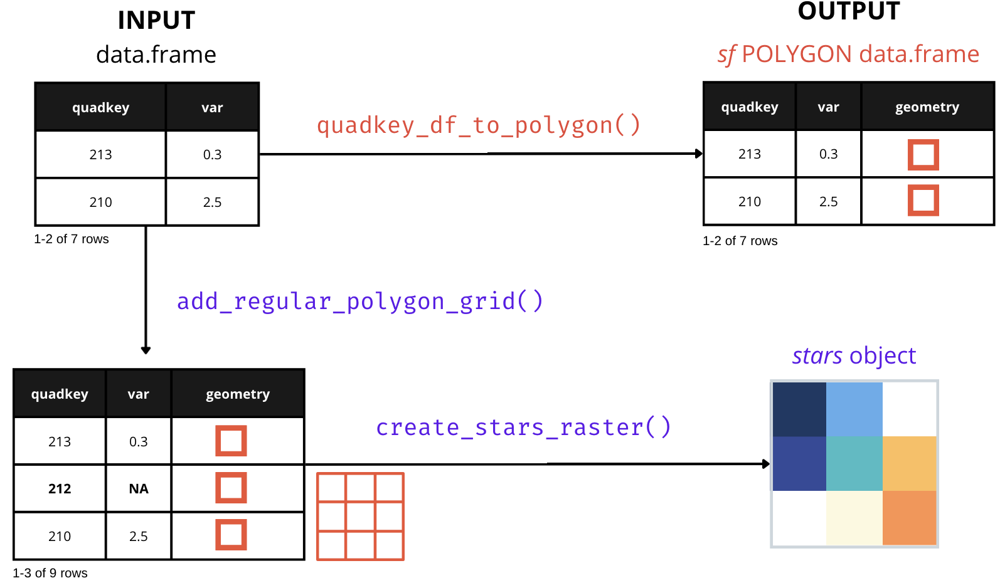

```{r, include = FALSE}
knitr::opts_chunk$set(
  collapse = TRUE,
  comment = "#>",
  warning = FALSE, 
  message = FALSE, 
  fig.width=7, 
  fig.height=7
)
```


> Please, visit the [README](https://fernandez-lab-wsu.github.io/quadkeyr/) 
> for general information about this package

Create a raster from QuadKey-identified data 
for a specified map area and zoom level. 
A detailed explanation of what 
tile coordinates (`tileX`, `tileY`) and 
pixel coordinates (`pixelX`, `pixelY`) are
can be found in `quadkeyr` vignette
[From QuadKey to Simple Features data.frame and other conversions](https://fernandez-lab-wsu.github.io/quadkeyr/articles/quadkey_to_sf_conversion.html)
and in the [official documentation](https://learn.microsoft.com/en-us/bingmaps/articles/bing-maps-tile-system).

# Basic workflow

```{r w2, echo = FALSE, out.width= "90%", fig.align='center'}

```


```{r setup, echo = FALSE}
library(quadkeyr)
library(sf)
library(rnaturalearth)
library(ggplot2)
library(dplyr)
library(stars)
```

If you are working with a data.frame with a `quadkey` column,
as shown as INPUT in the example image,
you can visualize the data by combining
the QuadKeys' spatial information with any other reported variable.
For example, let's read an example dataset:


```{r readdatahidden, echo = FALSE, include = FALSE}
# read the file with the data
path <- paste0(system.file("extdata", package = 'quadkeyr'), 
               "/cityA_2020_04_15_0000.csv")
data <- read.csv(path,
                 colClasses = c("character", "numeric",
                                "numeric", "character", 
                                "POSIXct",  "numeric", 
                                "numeric", "Date", "numeric"))
data <- format_fb_data(data)
```

```{r readdata}
head(data)
```

## Converting QuadKey-identified data to raster images
To create the raster,
it is preferable to work with a regular grid.
That is why we need to ensure that we have all the QuadKeys 
covering the bounding box we want to study.

The function `add_regular_polygon_grid()`
retrieves all the QuadKeys required to fill the bounding box 
created with the QuadKeys provided in the `quadkey` column.
The additional QuadKeys added in the process
will have `NA` values for all columns
except `quadkey` and `geometry`.

If you are unsure whether your grid is complete, 
you can still run the function,
and it will return the same `sf` POLYGON data.frame
without any extra rows.

```{r compolygrid}
complete_polygon_grid <- add_regular_polygon_grid(data = data)

complete_polygon_grid
```
As you can see in the following plot, 
we obtain a regular polygon grid where only the QuadKeys
that are reported with values for the variable of interest are colored.

The function `add_regular_polygon_grid()`
returns three outputs in a list: 
 - `data`
 - `num_cols` and;
 - `num_rows`. 
 
The number of columns and rows will be useful in the next step.
```{r reggrid, out.width= "70%", fig.align='center'}
ggplot() +
  geom_sf(data = complete_polygon_grid$data,
          aes(fill = percent_change)) +
  scale_fill_viridis_c(na.value = "transparent") +
  theme_minimal()
```

After obtaining the regular polygon grid,  
we can create a [STARS object](https://r-spatial.github.io/stars/articles/stars1.html) 
using the function `create_stars_raster`. 

```{r startsobj}
stars_object <- create_stars_raster(data = complete_polygon_grid$data,
                    template = complete_polygon_grid$data,
                    var = "percent_change",
                    nx = complete_polygon_grid$num_cols,
                    ny = complete_polygon_grid$num_rows)
stars_object
```

```{r rasterimage, out.width= "70%", fig.align='center'}
ggplot() +
  geom_stars(data = stars_object) +
    coord_equal() +
    theme_void() +
    scale_fill_viridis_c(na.value = "transparent") +
    scale_x_discrete(expand=c(0,0))+
    scale_y_discrete(expand=c(0,0))
```

## Quadkeys as polygons
If you want to visualize the QuadKeys without creating a raster image, 
you also have the option of converting 
the QuadKeys into an `sf` POLYGON data.frame using
the function `quadkey_df_to_polygon()`, and then plotting it.

```{r qkdf}
# create polygon column
poly_data <- quadkey_df_to_polygon(data = data)
poly_data
```

```{r polyplot, out.width= "70%", fig.align='center'}
ggplot() +
  geom_sf(data = poly_data,
          aes(fill = percent_change)) +
  scale_fill_viridis_c() +
  theme_minimal()
```

# Advanced use and intermediate functions
The function `add_regular_polygon_grid()` 
serves as a wrapper for three functions:
`get_qk_coords()`, `regular_qk_grid()`, and `grid_to_polygon()`.

We will demostrate some of the uses of these functions in isolation:

## Create a Quadkey-identified polygon regular grid
The `regular_qk_grid()` function generates
a regular grid by utilizing the `create_qk_grid()` function. 
To accomplish this,
it necessitates defining the bounding box,
specified by `xmin`, `xmax`, `ymin`, and `ymax`,
which delineates the area for QuadKey grid creation.
`regular_qk_grid()` supplies these arguments 
to `create_qk_grid()` by estimating the bounding box 
from the QuadKeys provided as an argument.
However, if desired, 
you can manually input these arguments 
and use the function by itself.

For this example, we have selected 
`xmin` = -59,
`xmax` = -57 ,
`ymin` = -35 and
`ymax` = -34. 
Let's plot them as points.

```{r pointsplot, echo=FALSE, out.width= "70%", fig.align='center'}
ggplot() + 
  geom_sf(data = ne_countries(returnclass = 'sf'),
          fill = 'beige') +
  geom_point(aes(x = -59, y = -35 ), color = 'purple') +
  geom_point(aes(x = -57, y = -34), color = 'purple') +
  coord_sf(xlim = c(-60, -56),
            ylim = c(-36, -33), expand = FALSE) +
    theme_minimal()  +
  theme(panel.background = element_rect(fill = "lightblue"),
        panel.ontop = FALSE,
        panel.grid.major = element_blank(), 
        panel.grid.minor = element_blank()) +
  ylab("Latitude") + 
  xlab("Longitude")

```

The QuadKey grid can have a zoom level between 1 (less detail) to 23 
(more detail). 

The function `create_qk_grid()` will return three outputs: 

  1. `grid$data` a dataframe with `tileX`, `tileY` and the QuadKey value for 
each element of the grid
  
  2. `grid$num_rows` the number of rows and
  
  3. `grid$num_cols` the number of columns of the grid.

```{r cqg}
grid <-  create_qk_grid(
               xmin = -59,
               xmax = -57,
               ymin = -35,
               ymax = -34,
               zoom = 12)
head(grid$data)
```

### Get the grid coordinates from the QuadKeys

The coordinates are extracted from the QuadKeys 
using the function `get_qk_coords()`. 

```{r grid}
grid_coords <- get_qk_coord(data = grid$data)
head(grid_coords)
```
We can visualize the points in the map to understand better the results.

```{r mapgrid, echo = FALSE, out.width= "70%", fig.align='center'}
min <- st_sfc(st_point(c(-59,-35)), crs = 4326)
max <- st_sfc(st_point(c(-57,-34)), crs = 4326)
ggplot() + 
  geom_sf(data = ne_countries(returnclass = 'sf'),
          fill = 'beige') +

  geom_sf(data = min, color = 'purple') +
  geom_sf(data = max, color = 'purple') +
    geom_sf(data = grid_coords, alpha = 0.5, size = 0.5) +
  coord_sf(xlim = c(-60, -56),
            ylim = c(-36, -33), expand = FALSE) +
  theme_minimal()  +
  theme(panel.background = element_rect(fill = "lightblue"),
        panel.ontop = FALSE,
        panel.grid.major = element_blank(), 
        panel.grid.minor = element_blank()) +
  ylab("Latitude") + 
  xlab("Longitude")
```
We have a grid of points representing the QuadKeys. 
Remember that these points 
represent the upper-left corner of each QuadKey, 
which might give the impression
that they do not precisely cover the entire area 
defined by the initial points. 


### Conversion to polygons
As we are creating the polygons from a `sf` POINT data.frame
we can use `grid_to_polygon()`.

```{r poly}
polygrid <- grid_to_polygon(grid_coords)
polygrid

```

```{r map, echo = FALSE, out.width= "70%", fig.align='center'}

min <-st_sfc(st_point(c(-59,-35)), crs = 4326)
max <- st_sfc(st_point(c(-57,-34)), crs = 4326)
ggplot() + 
  geom_sf(data = ne_countries(returnclass = 'sf'),
          fill = 'beige') +

  geom_sf(data = min, color = 'purple') +
  geom_sf(data = max, color = 'purple') +
    geom_sf(data = polygrid, alpha = 0.5, 
            size = 0.5, fill = NA, color = 'red') +
  coord_sf(xlim = c(-60, -56),
            ylim = c(-36, -33), expand = FALSE) +
  theme_minimal()  +
  theme(panel.background = element_rect(fill = "lightblue"),
        panel.ontop = FALSE,
        panel.grid.major = element_blank(), 
        panel.grid.minor = element_blank()) +
  ylab("Latitude") + 
  xlab("Longitude")

```

It worked! As you can see here, 
the coordinates we randomly selected as 
a starting point for the bounding box
are situated within the polygons, 
but not at a specific position inside each polygon. 
This was expected, you can read about 
Quadkey conversion in the vignette [Bing Maps Tile System Functions](https://fernandez-lab-wsu.github.io/quadkeyr/articles/1_bing_map_tile_system_functions.html).

If you want to see the grid, you can also check the app:

```{r eval = FALSE}
qkmap_app()
```

```{r qkmap_grid, echo = FALSE, out.width= "70%", fig.align='center'}
knitr::include_graphics("qkmap_grid.png")
```

## Raster creation

Let's generate the raster. 
`data_provided` is an example 
QuadKey-identified data.frame. 

```{r datap}
data('data_provided')
head(data_provided)
```

The function `get_qk_coord()` allow us 
converting the data to an `sf` POINT data.frame
keeping our variable of interest.
```{r}
data_sfpoint <- get_qk_coord(data = data_provided)
head(data_sfpoint)
```

```{r points, echo = FALSE, out.width= "70%", fig.align='center'}
ggplot() +
  geom_sf(data = data_sfpoint, color = 'red') +
  theme_minimal()
```

In this case, it seems we are working with a regular grid,
so we can skip `regular_qk_grid()`.
If you execute it, it will only confirm with a message
and return the same `sf` POINT data.frame.
This function returns a list,
providing you with the number of columns and rows that 
we will have to introduce as arguments of  `create_stars_raster()`

```{r datarast}
data_raster <- regular_qk_grid(data = data_sfpoint)
head(data_raster)
```

```{r polyrasterdata}
polygon_raster <- grid_to_polygon(data = data_raster$data)
head(polygon_raster)
```


Now, we can use the data.frame to create the raster:

```{r raster}
raster <-  create_stars_raster(template = polygon_raster,
                               nx = data_raster$num_cols,
                               ny = data_raster$num_rows,
                               data = polygon_raster,
                               var = 'variable')

raster

# In case you want to save it:
# write_stars(obj = raster,
#             dsn = "raster.tif")

```


```{r plot, echo = FALSE}

min <-st_sfc(st_point(c(-59,-35)), crs = 4326)
max <- st_sfc(st_point(c(-57,-34)), crs = 4326)
ggplot() + 
  geom_sf(data = ne_countries(returnclass = 'sf'),
          fill = 'beige') +

  geom_sf(data = min, color = 'purple') +
  geom_sf(data = max, color = 'purple') +
  geom_stars(data = raster, alpha = 0.5) +
    geom_sf(data = polygon_raster, alpha = 0.5,
            size = 0.5, color = 'red', fill = NA) +
  coord_sf(xlim = c(-60, -56),
            ylim = c(-36, -33), expand = FALSE) +
  viridis::scale_fill_viridis() +
  theme_minimal()  +
  theme(panel.background = element_rect(fill = "lightblue"),
        panel.ontop = FALSE,
        panel.grid.major = element_blank(), 
        panel.grid.minor = element_blank()) +
  ylab("Latitude") + 
  xlab("Longitude")

```