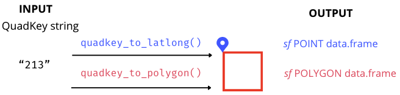

```{r, include = FALSE}
knitr::opts_chunk$set(
  collapse = TRUE,
  comment = "#>"
)
```

```{r setup, echo = FALSE, message=FALSE, warning=FALSE}
library(quadkeyr)
library(ggplot2)
```

> Please, visit the [README](https://fernandez-lab-wsu.github.io/quadkeyr/) 
> for general information about this package

Most of the function and arguments names conserved from the documentation.
`quadkeyr` functions are the R version of the ones described in [Bing Maps Tile System webpage](https://learn.microsoft.com/en-us/bingmaps/articles/bing-maps-tile-system).


## Basic workflow

```{r w1, echo = FALSE, out.width= "90%", fig.align='center'}

```

You can convert any QuadKey to
a [Simple Features object](https://r-spatial.github.io/sf/articles/sf1.html#sf-objects-with-simple-features)
`sf` POINT data.frame or `sf` POLYGON data.frame 
using the functions `quadkey_to_latlong()` and `quadkey_to_polygon()`. 
It's important to notice that the geographic coordinates of the point 
will always correspond to the upper-left corner of the polygon
for the same QuadKey.

```{r}
qtll <- quadkey_to_latlong(quadkey = "2103")
qtll
```

```{r}
qtp <- quadkey_to_polygon(quadkey = "2103")
qtp
```

```{r qk, out.width="50%", fig.align='center'}
ggplot() +
  geom_sf(data = qtp, color = 'red', fill = NA, linewidth = 2.5) +
  geom_sf(data = qtll, color = 'blue', size = 4) + 
  ggtitle(paste("QuadKey", qtll$quadkey)) +
  theme_minimal()
```
If you want to convert a data.frame `quadkey` column 
to a `sf` POLYGON data.frame.
you can use the function `quadkey_df_to_polygon()` 
described in the
['Generating a Raster Image from Quadkey-Identified Data' vignette](https://fernandez-lab-wsu.github.io/quadkeyr/articles/quadkey_identified_data_to_raster.html)

## Advanced use

The conversion from QuadKey to geographic coordinates
involves a series of smaller transformations that
relate to the structure of Tile Maps. 
All of these intermediary functions, 
as well as those facilitating the reverse conversion,
are available for use within the `quadkeyr` package.

### Tile Maps: QuadKeys, tiles, pixels and geographic coordinates

> Note: In the official documentation, 
> the term 'level of detail' is equivalent to 
> what is here referred to as 'zoom level'.

Tile maps are composed of pixels that are grouped into tiles. 
Later, the tiles are converted to QuadKeys to optimize map performance,
among other benefits described in detail in 
[the documentation](https://learn.microsoft.com/en-us/bingmaps/articles/bing-maps-tile-system).

Pixels and tiles are expressed as two-dimensional coordinates 
- (`pixelX`, `pixelY`) and (`tileX`, `tileY`) - 
but Quadkeys are one-dimensional numeric strings.
This is important to understand how the conversion works.

Each geographic pair of coordinates (latitude/longitude) 
will belong to a specific pixel 
referenced by coordinates (`pixelX`, `pixelY`) 
for each zoom level. 
In Fig. 1, you can see pixels (0, 0) and (2047, 2047)
for zoom level 3. 
The `quadkeyr` function `latlong_to_pixelXY()`, 
converts geographic coordinates (latitude/longitude) 
in pixel coordinates for each zoom level.


```{r pixels, echo = FALSE, out.width= "50%", fig.align='center', fig.cap= "Fig 1. Pixels (0, 0) and (2047, 2047) for a map with zoom level 3. Image extracted from Microsoft's Bing Maps Tile System webpage."}
knitr::include_graphics('bing_pixel.jpg')
```


In turn, a tile is comprised of 256x256 pixels. 
The tile coordinates are visually represented in Fig. 2. 
These coordinates will ultimately be converted 
into one-dimensional QuadKeys.

For instance, a pixel for zoom level 3 represented by
the coordinates `pixelX` = 255 and 
`pixelY` = 12 is part of the tile with 
coordinates `tileX` = 0 and `tileY` = 0. 
The pixel with coordinates (0,0) belongs to tile (0,0), and the 
pixel (2047, 2047) is part of tile (7,7). 
You can verify this using 
the function `pixelXY_to_tileXY()` and
by comparing Fig. 1 and Fig. 2.

```{r tiles, echo = FALSE, out.width= "50%", fig.align='center', fig.cap= "Fig 2. Tile coordinates. Image extracted from Microsoft's Bing Maps Tile System webpage."}
knitr::include_graphics('bing_tiles.jpg')
```

To convert from tile XY coordinates to QuadKeys for a particular
zoom level, you can use the function `tileXY_to_quadkey()`. 
The number of digits of the QuadKey will correspond to the zoom level
of the map. For example, for the tile (4, 7) of zoom level 3, the
QuadKey will be `322`.

This pertains to the conversion from geographic coordinates (latitude/longitude)
to QuadKeys. However, when converting in the opposite direction, 
from QuadKeys to geographic coordinates (latitude/longitude), 
the final pair of latitude/longitude corresponds to 
the upper-left corner coordinates of the tile and pixel associated with
your original QuadKey.

To understand this in more detail, have a look to the functions and then read
section 3.

### If you have a pair of geographic map coordinates, convert them to a QuadKey

**Geographic coordinates** <span>&#8594;</span> **pixel XY coordinates**
<span>&#8594;</span> **tile XY coordinates** <span>&#8594;</span> **QuadKey**

> Note: 
> The latitude and longitude coordinates are in the WGS 84 reference system.

#### Convert latitude/longitude coordinates to pixel XY coordinates

```{r lltp}
lltp <- latlong_to_pixelXY(lat = -25, 
                           lon = -53, 
                           zoom = 4)
lltp
```

#### Convert pixel XY coordinates into tile XY coordinates

```{r ptt}
ptt <- pixelXY_to_tileXY(pixelX = lltp$pixelX,
                         pixelY = lltp$pixelY)
ptt
```

#### Convert tile XY coordinates into a QuadKey

This function returns the QuadKey string. 
Since we are estimating zoom level 4,
the number consists of 4 digits.

```{r ttq}
tileXY_to_quadkey(tileX = ptt$tileX,
                  tileY = ptt$tileY,
                  zoom = 4)
```

The function `latlong_to_quadkey()` 
wraps the last three functions,
and converts map coordinates into a QuadKey
for a particular zoom level:

```{r}
latlong_to_quadkey(lat = -25,
                   lon = -53,
                   zoom = 4)
```

This function also work for multiple coordinates:

```{r}
latlong_to_quadkey(lat = c(-4, -25.33, -25.66),
                   lon = c(-53, -60.33, -70.66),
                   zoom = 4)
```

### If you have a QuadKeys, convert them to a pair of map coordinates

Let's attempt the reverse route.

**QuadKey** <span>&#8594;</span>  **tile XY coordinates** <span>&#8594;</span> 
**pixel XY coordinates** <span>&#8594;</span> **Geographic coordinates** 

#### Convert a QuadKey into tile XY coordinates 

```{r qtt}
qtt <- quadkey_to_tileXY("2103")
qtt
```


#### Convert tile XY coordinates into pixel XY coordinates 

```{r ttp}
ttp <- tileXY_to_pixelXY(tileX = qtt$tileX,
                         tileY = qtt$tileY)
ttp
```


#### Convert pixel XY coordinates into lat/long coordinates 

```{r ptll}
ptll <- pixelXY_to_latlong(pixelX = ttp$pixelX,
                           pixelY = ttp$pixelY,
                           zoom = 4)

ptll
```

You can also use the function `quadkey_to_latlong()` 
that wraps the last three functions and returns a `sf` POINT data.frame.

```{r}
quadkey_to_latlong(quadkey = "2103")
```

### Caveats when converting coordinates

Given the process of converting 
geographic coordinates (latitude/longitude) to QuadKeys, 
one might expect that the conversion back to
latitude/longitude coordinates (as in section 2.3) 
would yield the same values as the original input in section 1.

However, this isn't the case, as evidenced by the results of the 
functions `pixelXY_to_tileXY()` and `tileXY_to_pixel_XY()`.

When choosing latitude/longitude coordinates 
in the initial function in section 1,
they were within a specific pixel represented by 
unique tile coordinates and QuadKey.
As you can see in the example in this vignette, 
the conversion back from QuadKey to latitude/longitude
does not directly result in the same initial geographic coordinates.

This discrepancy arises because `tileXY_to_pixel_XY()` 
provides the pixel coordinates for the upper-left corner of the tile, 
not the exact coordinates chosen initially.
For example, if you run `tileXY_to_pixelXY()` for
the tile XY coordinates are (7, 7),
the resulting pixel XY coordinates are (1792, 1792) and
no (2047, 2047) as you could see in Fig. 2.
As each tile is 256x256 pixels, 
you can easily check that the result is the upper-left pixel 
of that tile. The same will happen for `pixelXY_to_latlong()`. 

Hence, converting latitude/longitude coordinates into a QuadKey 
and then back to latitude/longitude won't yield identical values, 
unless the initial latitude/longitude coordinates correspond to
the upper-left to the upper-left Quadkey's pixel and tile XY coordinates
at the same zool level. 

Consider as initial values the coordinates result of 
the conversion from QuadKey to latitude/longitude 
obtained in section 2.3 `(lat = -21.94305, lon = -67.5)` 
and rerun all functions from the beginning.
You'll proof this way that obtaining the original geographic coordinates
is unlikely unless the initial coordinates correspond 
to the upper-left upper-left Quadkey's pixel and tile XY coordinates.

Understanding this distinction is crucial for 
the accurate use of these functions in coordinate conversions.

### Additional functions

In addition to the conversion functions mentioned earlier,
the `quadkeyr` package also includes the following functions:
`mapsize()`, `mapscale()`, and `ground_res()`.
These functions are described on the
[Bing Maps Tile System webpage](https://learn.microsoft.com/en-us/bingmaps/articles/bing-maps-tile-system) 
and are available for its use.


## QuadKey map visualizer app

You can visualize the QuadKey location in the map 
using the Shiny app included in this package.

```{r eval = FALSE}
qkmap_app()
```

```{r qkmap_qk, echo = FALSE, out.width= "90%", fig.align='center'}
knitr::include_graphics("qkmap_qk.png")
```

