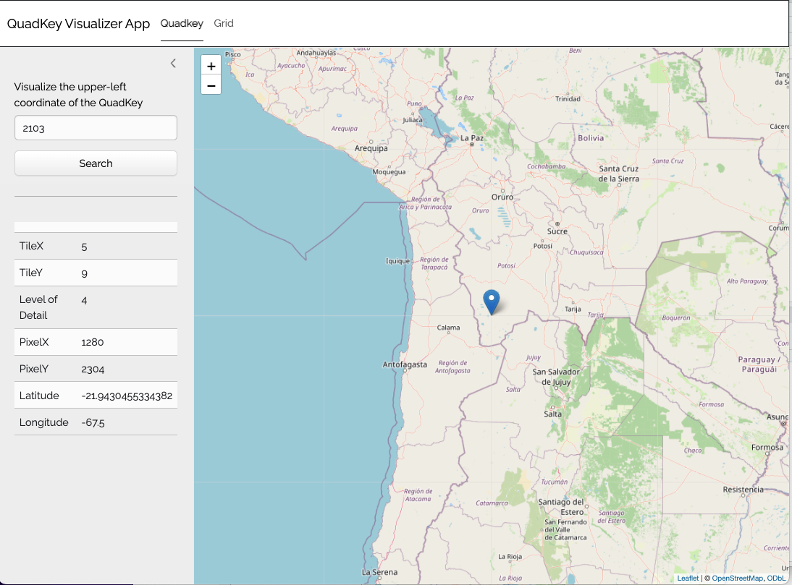

```{r, include = FALSE}
knitr::opts_chunk$set(
  collapse = TRUE,
  comment = "#>"
)
library(quadkeyr)
```

> Please, visit the [README](https://docs.ropensci.org/quadkeyr/) 
> for general information about this package

To easily visualize:

1. The QuadKey location based on provided geographic coordinates, and
2. The grid for the area delimited by two pairs of geographic coordinates,
   you can utilize the internal app provided by `quadkeyr`.

# Run the app

You can open the app running:

```{r eval = FALSE}
quadkeyr::qkmap_app()
```

# Tabs
## QuadKey tab

On the first tab, you can locate the upper corner of the QuadKey on the map 
and discover its zoomlevel, 
as well as the associated tile and pixel coordinates.

```{r qkmap_qk_app, echo = FALSE, out.width= "90%", fig.align='center'}

```

## Creating a QuadKey grid tab

The second tab allows you to visualize the grid created using 
the `grid_to_polygon` function and locate specific QuadKeys.

```{r qkmap_grid_app, echo = FALSE, out.width= "90%", fig.align='center'}
knitr::include_graphics("qkmap_grid.png")
```

# Performance

Note that for higher levels of detail, it is preferable to use
smaller areas (< 2000 QuadKeys) to prevent long processing times.


